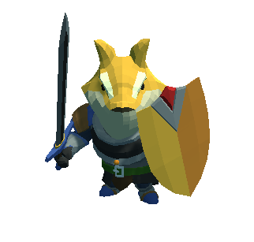
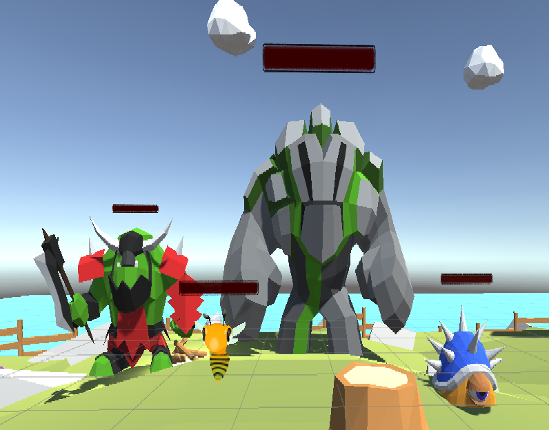
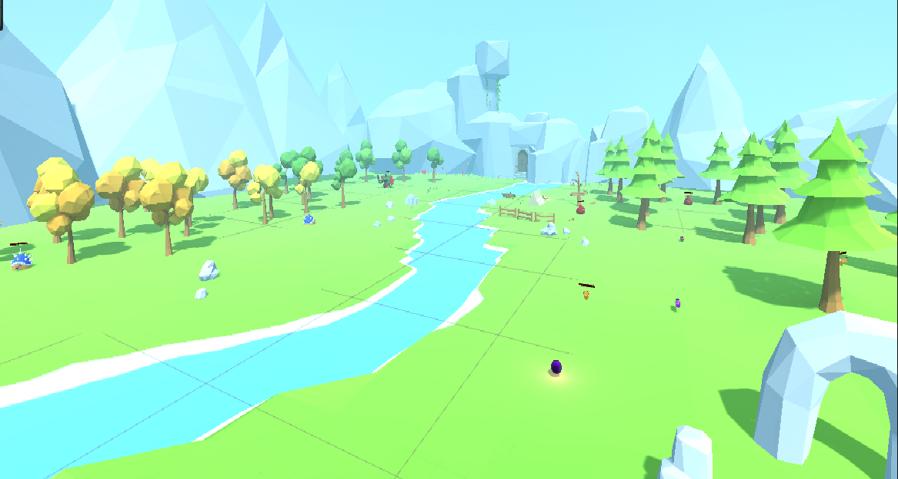
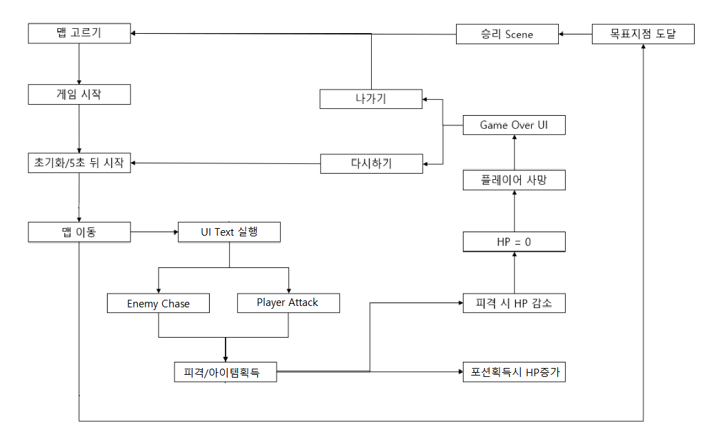
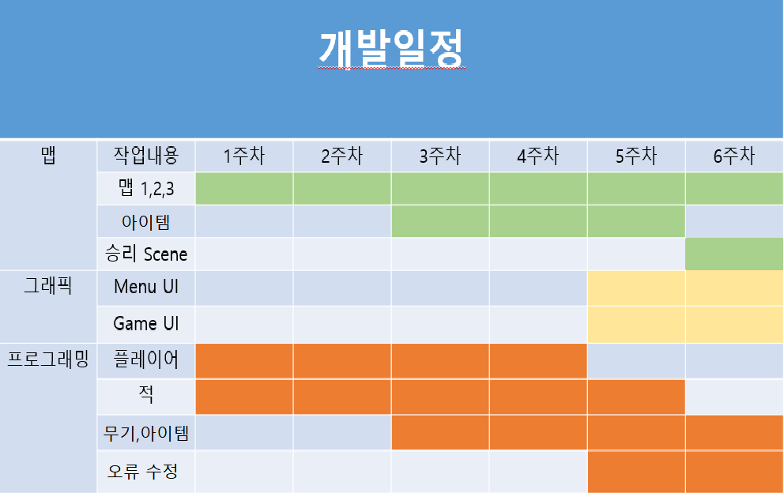

# 프로젝트명: 멍생라이프(개발자:신종호)

# [ 목차 ]
### 1. [컨셉](#1)
### 2. [대표 이미지 그리고 컨셉과 대표이미지 기반 작품 묘사](#3)
### 3. [멍생라이프의 구성 요소](#4)
### 4. [게임 시스템 디자인](#5)
### 5. [요구사항(6주차)](#6)
### 6. [시간별 흐름(flowchart)](#7)
### 7. [키보드 이벤트에 대한 흐름도](#8)
### 8. [개발일정](#9)

# [컨셉] 

## 메인컨셉 : 힐링

- 반려견의 꿈을 보는 컨셉으로 게임 전체적인 부드러움과 아기자기한 모습에 힐링이 됨

### 서브 컨셉 1 : 병맛

- Re:Zero부터 시작하는 초특급 교내 SSS급 두번 사는 쿨뷰티미녀의 반려견 애옹이란 컨셉으로 재미를 줌

### 서브 컨셉 2 : 액션

- 다양한 몬스터와 싸우는 흥미진진한 액션

### 서브 컨셉 3 : 수류탄

- 수류탄 획득 시 플레이어 주변을 떠다니며 사용시 엄청난 이펙트와 데미지를 주는 사기적인 무기

### 서브 컨셉 4 : 이펙트

- 무기별로 공격 시 이펙트가 달라 단조롭지 않고 게임이 지루하지 않게 함

### 서브 컨셉 5 : 맵

- 낮과 밤 컨셉의 맵 그리고 최종보스 맵까지 Low-Poly로 제작하여 게임 전반적으로 부드럽고 아기자기한 느낌을 줌

  

# [포스터 이미지]

  

  

# [컨셉 & 대표이미지 기반 작품묘사] 

> ### 대표이미지 기반 : 대충 초특급 교내 SSS급 어쩌구 쿨뷰티미녀의 반려견 애옹이!!

> ### 컨셉 기반: 용감한 주인공의 모습

  

# [<멍생라이프> 구성 요소] 

- [멍생라이프]

 

## 1. 메커니즘

[도전 과제]

1. 몬스터를 처치하여 목표지점까지 도달하라
2. 3가지 맵을 클리어 하여라

[재미 요소]

1. 다양한 몬스터와 여러 무기를 통한 전투
2. 수류탄을 통한 색다른 전투
3. 오브젝트들이 아기자기하고 귀여워서 플레이하면서 힐링을 함

 

## 2. 이야기

[게임 스토리]  
Re:Zero부터 시작하는 초특급 교내 SSS급 두번 사는 쿨뷰티미녀의 반려견 애옹이의 꿈에 들어가게 된 주인의 시점으로 애옹이의 꿈을 구경하는 스토리.
  
[만들게 된 배경]  
처음에는 탑뷰 형색의 2D를 생각했지만 3D가 더 재밌겠다는 생각에 로그라이크 RPG형식의 게임을 만들게 됬습니다.

[카메라 관점]  
3D 3인칭 탑 뷰

 

## 3. 미적요소

[디자인][컬러]  
첫번째 맵은 주인공 애옹이의 꿈 속 맵입니다. 애옹이가 싸우는 첫 맵인 만큼 귀엽고 부드러운 느낌을 주는 Low-Poly 기반의 맵을 제작하였습니다.

두번째 맵은 밤이 된 맵입니다. 해가 져서 어둡지만 오히려 차분해진 분위기의 맵으로 첫번째 맵 몬스터들 보다 더 강한 몬스터를 배치하였습니다.

세번째 맵은 최종보스 단단이와의 전투맵 입니다. 보스까지 가는 길에 몬스터를 처치하고 수류탄 아이템을 획득 해 보스전투 때 활용할 수 있게 제작하였습니다.

 

## 4. 기술

unity를 활용해 3D 3인칭 게임을 만들었습니다.
  
# [게임 시스템 디자인] 
 
# 1. 게임 오브젝트 분해 (구성 요소 분석)
  
|번호|오브젝트 이름(영문명칭)|오브젝트 이미지|
|:----:|:----:|:----:|
|1|player||
|2|enemy 1,2,3,4||
|3|Map||
|4|PlayerHp||
  
   
## 2. 파라미터(속성) 뽑아 보기
   
# 1) 오브젝트 이름 : player 1,2,3
  
|속성|영문명칭|설명|비고|
|:----:|:----:|:----:|:----:|
|체력|PlayerHp|플레이어의 체력||
|이동속도|PlayerSpeed|플레이어의 이동 속도||
|달리기|L.SHift|기존 움직임보다 1.5배 빠름|
|공격|Attack|무기를 들었을 경우 좌클릭으로 공격|무기마다 데미지가 다름|
  
   
# 2) 오브젝트 이름 : Enemy 1,2,3,4
  
|속성|영문명칭|설명|
|:----:|:----:|:----:|
|사격|Attack|Enemy마다 각기 다른 데미지로 공격|
|사격범위|AttackRange|Enemy 크기마다 공격 범위가 다름|
|쫒기|Chase|일정 범위안에 들어오면 플레이어를 따라감|
  
   
  
# 3) 오브젝트 이름 : 맵 1,2,3
  
|속성|영문명칭|설명|몬스터|
|:----:|:----:|:----:|:----:|
|서부시대 맵|Map|부드럽고 귀여운 밝은 맵|벌, 슬라임, 오크|
|길거리 초입 맵|NightMap|어두워진 맵|슬라임, 오크|
|후드 길거리 맵|BossMap|보스가 사는 곳이라 돌로 가득한 맵|오크, 보스|

 
  
## 3. 행동 뽑아 보기
  
# 1) 오브젝트 이름 : Player 1,2,3
  
|행동|설명|
|:----:|:----:|
|앞으로 이동(W)|Idle 상태에서 정면으로 이동|
|뒤로 이동(S)|Idle 상태에서 뒤으로 이동|
|좌로 이동(A)|Idle 상태에서 좌로 이동|
|우로 이동(D)|Idle 상태에서 우로 이동|
|뛰기(L.Shift)|빠르게 달림(기존속도보다 1.5배)|
|아이템 획득(E)|무기를 획득함|
|수류탄 투척(G)|수류탄을 던짐|

 
  
# 2) 오브젝트 이름 : Enemy 1,2,3,4
  
|행동|설명|특징|
|:----:|:----:|:----:|
|공격범위|Enemy가 일정거리 안으로 Player가 들어올 시 공격하러 따라감|범위 밖의 공격하면 따라가진 않음|
|공격|Enemy가 플레이어에게 공격함|Enemy마다 공격력이 다름|

 
  
## 4. 상태 뽑아 보기
  
# 1) 오브젝트 이름 : Player 1,2,3
  
|현상태|전이상태|전이조건|
|:----:|:----:|:----:|
|Idle|W|Idle 상태에서 정면으로 이동|
|Idle|S|Idle 상태에서 뒤으로 이동|
|Idle|A|Idle 상태에서 좌로 이동|
|Idle|D|Idle 상태에서 우로 이동|
|Idle|E|아이템과 상호작용|
|Idle|G|수류탄 투척|
|Idle|Left Shift|달리기 상태|
|Idle|damaged|플레이어가 데미지를 입은 상태(1초간 무적)|
|damaged|Idle|1초간 무적상태에서 Idle 상태로 전환|
|Idle|마우스|시점변환|
|Idle|마우스 좌클릭|공격 상태|
 
  
# 2) 오브젝트 이름 : Enemy 1,2,3,4
  
|현상태|전이상태|전이조건|
|:----:|:----:|:----:|
|Idle|Chase|플레이어가 일정범위안에 들어올 경우 플레이어를 따라감|
|Chase|AttackRange|공격범위안에 들어올 경우 공격준비|
|AttackRange|Attack|공격준비에서 공격으로 상태변환|
|Attack|Chase|공격이 끝나면 Chase 상태로 돌아옴|
|Idle|Damaged|Enemy 피격상태|

 
  
## 1) 6. 게임의 규칙
  
플레이어가 3개의 맵을 지나 Ending Scene까지 도달해야 승리. 몬스터에게 당해 HP가 0이하로 떨어지면 패배.

## 7. 게임에서 사용될 공식
  
1. 플레이어가 피격 당할 경우 피격상태로 변환 -> 1초간 무적상태 -> HP 감소 -> 일반상태로 변환
2. 문에 닿으면 다음 맵으로 이동
3. HP potion과 Speed potion을 먹으면 각각 HP와 Speed가 올라감

## [요구사항(6주차)] 
  
[맵]
1. ~~맵 1,2,3 마다 다른 분위기로 제작.~~
2. ~~맵에 따라 몬스터 구성도 다르게 배치.~~
3. ~~맵 밖으로는 이동 할 수 없도록 한다.~~
4. ~~TitleScene/StageScene/LoadingScene/EndingScene으로 Scene 제작.~~
  
[그래픽]
1. ~~플레이화면 가운데 하단에 HP 바를 표시한다.~~
2. ~~수류탄 획득 시 플레이어 주변 돌아다니게 구현.~~
3. ~~공격시 각 무기마다 이펙트 다르게 구현.~~
  
[프로그래밍]
1. ~~플레이어는 WASD로 이동하며 마우스로 시점을 회전 할 수 있다.~~
2. ~~Shift를 누르면 이동속도 1.5배.~~
3. ~~G를 누르면 수류탄 투척.~~
4. ~~E를 누르면 아이템 획득.~~
5. ~~플레이어 피격 시 빨갛게 구현~~
6. ~~몬스터 사망 시 날라가게 구현.~~
7. ~~몬스터들 공격력/HP 다르게 구현.~~
8. ~~게임 시작버튼 누르면 Stage1로 넘어가고 UI실행.~~
9. ~~Ai는 Idle상태에 있으며 플레이어가 일정범위로 가까워지면 Chase.~~
10. ~~플레이어 사망 시 슬로우모션 구현, 이후 Title Scene으로 이동.~~
11. 맵에 어울리는 bgm, 효과음 구현.
12. ~~문에 닿을 경우 다음 Scene으로 이동.~~
13. ~~아이템을 획득하고 해당 value값을 누르면 아이템 swap 구현.~~
   
# [시간별 흐름(flowchart)] 

  - 이미지

  
# [키보드 이벤트에 대한 흐름도] 

- 이미지

  
# [개발 일정] 

- 이미지

