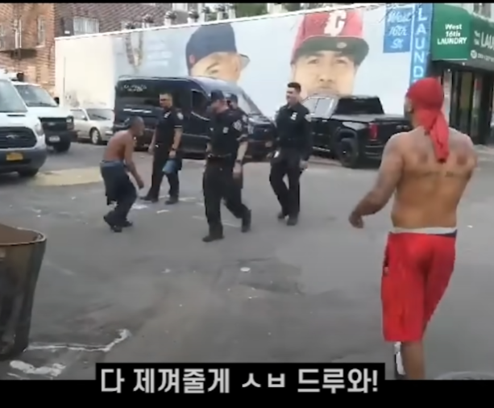

# 프로젝트명: Livin in Hood

# [ 목차 ]
### 1. [컨셉](#1)
### 2. [관련 이미지와 동영상](#2)
### 3. [대표 이미지 그리고 컨셉과 대표이미지 기반 작품 묘사](#3)
### 4. [Livin in Hood의 구성 요소](#4)
### 5. [게임 시스템 디자인](#5)
### 6. [요구사항(6주차)](#6)
### 6. [요구사항(1년차)](#66)
### 7. [키보드 이벤트에 대한 흐름도](#7)
### 8. [용어 정리](#8)
### 9. [개발 작업](#9)
### 10. [1주차 작업 결과](files/w09/index.md)
### 10. [2주차 작업 결과](files/w10/index.md)
### 10. [3주차 작업 결과](files/w11/index.md)
### 10. [4주차 작업 결과](files/w12/index.md)
### 10. [5주차 작업 결과](files/w13/index.md)
### 10. [6주차 작업 결과](files/w14/index.md)

# [컨셉] 

## 메인컨셉 : 스릴, 리얼함

- 리얼한 후드 길거리에서 장애물을 피하면서 총알을 피해야 하는 스릴

### 서브 컨셉 1 : 레이저

- 총알이 날아올 방향을 레이저로 표현해서 미리 총알 궤적을 알 수 있게 하여 난이도 조절이 가능하고 재미 요소가 됨

### 서브 컨셉 2 : 총 쏘는 시스템

- 플레이어가 현재 있는 위치 & 랜덤 위치에 총을 쏴서 유저들이 쉽게 피하지 못하게 하여 게임 난이도와 재미를 높임

### 서브 컨셉 3 : 총 쏘는 컨셉

- 카우보이 맵에서는 AI가 리볼버, 후드 길거리 초입에서는 피스톨과 smg, 완연한 후드의 길거리에서는 라이플을 쏩니다.

### 서브 컨셉 4 : 맵

- 좌측, 가운데, 우측 총 3개의 레일 위를 플레이어가 달릴 수 있고 첫번쨰 맵은 카우보이 페스티벌, 두번째 맵은 후드의 초입의 길거리 세번째 맵은 완연한 후드의 길거리 입니다.

### 서브 컨셉 5 :긴장감

- 애니메이션이나 영화에서만 보던 총알 피하기를 직접 해봄으로써 긴장감을 느끼고 그것이 큰 재미로 다가옵니다.

  

# [관련 이미지 & 동영상] 

- 이미지  
  
- 동영상
  

  

# [대표 이미지]

  

# [컨셉 & 대표이미지 기반 작품묘사] 

> ### 대표이미지 기반 : 후드에서 살아가려면 경찰을 두려워하면 안된다.

> ### 컨셉 기반: 빠꾸없는 후드의 길거리에서 살아남기 위해 열심히 살아가는 주인공의 모습

  

# [<Livin in Hood> 구성 요소] 

- 후드에서 살아남기

 

## 1. 메커니즘

[도전 과제]

1. AI의 총을 피해 목표지점까지 도달하라
2. 3가지 맵을 클리어 하여라
3. 돈을 모아 캐릭터를 꾸미어라

[재미 요소]

1. AI가 총 쏘는 유도선을 피하며 목표지점에 도달
2. 장애물에 몸을 숨겨서 총을 피함
3. 맵에 드랍된 아이템을 얻어 여러 효과를 이용(ex : 마약-이동속도up, kfc치킨-Hp up)

 

## 2. 이야기

[만들게 된 배경]  
유튜브에서 후드에서 살아남기라는 밈을 자주 보면서 너무 재있었고 예전에 봤던 애니메이션에 나왔던 게임과 접목하면 재미있겠다고 생각했습니다.

[카메라 관점]  
3D 1인칭 뷰로 생각하고 나중엔 VR로도 구현해 볼 계획입니다.

 

## 3. 미적요소

[디자인][컬러]  
첫번째 맵은 주인공이 어렸을 때 카우보이 페스티벌에서 후드식 장난을 하는 컨셉입니다.
카우보이가 주인공을 향해 리볼버를 쏘고 주변 사물도 카우보이시대로, 몸을 숨길 장애물로 회전초를 생각했습니다.

두번쨰 맵은 주인공이 청년이 되었을 때의 모습이고 후드의 초입을 걸어가다가 마주치는 상황을 맵으로 구현할 생각입니다.
AI는 피스톨과 smg를 쏘고 몸을 숨길 장애물로는 드럼통or쓰레기통을 생각하고 있습니다.

세번째 맵은 완연한 후드인이 되어 평범한 후드의 삶을 지내는 후드인이 된 주인공의 모습을 컨셉으로 하고 있습니다.
AI는 경찰의 모습으로 라이플을 쏘고 장애물은 경찰차로 할 생각입니다.

[음향]  
카우보이 맵에서는 lil nas x - old town load 를 2,3번째 맵에서는 snoop dog나 eminem등의 래퍼의 노래를 생각하고 있습니다.
 

## 4. 기술

unity를 활용해 3D 1인칭 게임을 만들생각입니다.
방학동안에는 VR을 공부해서 최종적으로는 VR게임을 만들어 보도록 할 생각입니다.
  
# [게임 시스템 디자인] 

## 1. 게임 오브젝트 분해 (구성 요소 분석)
  |
번호
|
오브젝트 이름(영문명칭)
|
오브젝트 이미지
|
  |:----:|:----:|:----:|
  |1|player1,2,3|  |
  |2|Ai 1,2,3|  |
  |3|Map||
  |4|PlayerHp||
  
  
## 2. 파라미터(속성) 뽑아 보기
  
# 1) 오브젝트 이름 : player 1,2,3
  |
속성
|
영문명칭
|
설명
|
비고
|
  |:----|:----|:----|:----|
  |체력|PlayerHp|플레이어의 체력||
  |이동속도|PlayerSpeed|플레이어의 이동 속도||
  |구르기|Skill|원하는 방향으로 일정거리 구름|원하는 곳으로 굴러 총알을 피함|
  |앉기|Sit|Player.position에 player가 앉음|장애물 뒤에 숨거나 총알을 피함|
  
# 2) 오브젝트 이름 : Ai 1,2,3
  |
속성
|
영문명칭
|
설명
|
  |:----|:----|:----|
  |사격|Fire|Ai가 Player.position 및 랜덤 위치에 사격|
  |레이저|Razer|사격하기 몇초 전 레이저가 총구에서 사격방향으로 나옴|
  
# 3) 오브젝트 이름 : 맵 1,2,3
  |
속성
|
영문명칭
|
설명
|
장애물
|
  |:----|:----|:----|:----|
  |서부시대 맵|WesternMap|후드식 페스티벌 속 서부시대 배경으로 하는 총게임의 맵|회전초|
  |길거리 초입 맵|StreetMap|Street에서 겪을 수 있는 일상을 자아낸 맵|드럼통|
  |후드 길거리 맵|HoodMap|완연한 후드인의 일상을 표현한 맵|경찰차|
  |모든 맵은 시간이 지날수록 장애물이 적어짐|
  
## 3. 행동 뽑아 보기
  
# 1) 오브젝트 이름 : Player 1,2,3
  |
행동
|
설명
|
  |:----|:----|
  |앞으로 이동(W)|Idle 상태에서 정면으로 이동|
  |뒤로 이동(S)|Idle 상태에서 뒤으로 이동|
  |좌로 이동(A)|Idle 상태에서 좌로 이동|
  |우로 이동(D)|Idle 상태에서 우로 이동|
  |구르기(Shift)|쿨타임 6초(구르는 시간은 1.5초)|
  |앉기(Ctrl)|쿨타임 2초(앉는 키 누른 동안은 계속 유지)|

# 2) 오브젝트 이름 : Ai 1,2,3
  |
행동
|
설명
|
특징
|
  |:----|:----|:----|
  |사격|Ai가 Player.position 및 랜덤위치에 사격|맵의 난이도마다 총이 다름/ 1.Anaconda  2.Pistol  3.Rifle|
  |레이저|사격하기 몇초 전 레이저가 총구에서 사격방향으로 나옴|플레이 중 일정 시간이 지나면 레이저 지속 시간이 줄어듬|
  
## 4. 상태 뽑아 보기
  
# 1) 오브젝트 이름 : Player 1,2,3
  |
현상태
|
전이상태
|
전이조건
|
  |:----|:----|:----|
  |Idle|W|Idle 상태에서 정면으로 이동|
  |Idle|S|Idle 상태에서 뒤으로 이동|
  |Idle|A|Idle 상태에서 좌로 이동|
  |Idle|D|Idle 상태에서 우로 이동|
  |Idle|Skill|Idle 상태에서 Player가 보는 방향으로 구름(WASD 누른 상태에서도 가능)|
  |Idle|Sit|Idle 상태에서 Player가 지금 위치에 앉음|
  |Sit|Idle|앉은 상태(Ctrl)을 누른 시간동안 앉은 자세 유지/ Ctrl키 놓으면 Idle 상태|
  
# 2) 오브젝트 이름 : Ai 1,2,3
  |
현상태
|
전이상태
|
전이조건
|
  |:----|:----|:----|
  |Idle|Razer|Idle상태가 몇초간 지속되면 Player.position 및 랜덤 위치에 레이저 발사|
  |Razer|Fire|빨간색 Razer의 지속시간이 끝나면 발사, 데미지 입힘(시간이 지날수록 발사 텀이 짧아짐)|
  |Razer2|Fire|초록색 Razer의 지속시간이 끝나면 발사, HP회복(맵에 따라 정해진 횟수만 발사)|
  |Fire|Idle|사격이 끝나면 Idle 상태로 돌아옴|
  
## 5. 플레이어 캐릭터 속성(파라미터)
  |
속성
|
영문명칭
|
설명
|
  |:----|:----|:----|
  |어린 후드인|Player1|어린아이의 모습/ 완숙한 후드인의 1/4의 HP와 이동속도를 가짐|
  |젊은 후드인|Player2|성인의 모습/ 완숙한 후드인의 1/2의 HP와 이동속도를 가짐|
  |완숙한 후드인|Player3|후드인의 모습/ 빠른 이동속도|
  
## 1) 6. 게임의 규칙
  
플레이어가 AI가 있는 곳까지 도달해야 승리. AI가 쏘는 총에 맞고 체력이 0이 되면 패배. 제한 시간 안에 도달하지 못할 시 패배

## 7. 게임에서 사용될 공식
  
플레이어가 피격 당할 경우 피격상태로 변환 -> 1초간 무적상태 -> HP 감소 -> 일반상태로 변환
장애물에도 체력이 있어서 무한정 숨어 있을 수 없음
 
## [요구사항(6주차)] 

[그래픽]
1. 3가지 맵을 고르는 화면이 있다.
2. 맵을 클릭하고 시작버튼을 누르면 맵에 총알 자국이 생기고 게임이 시작된다.
3. 로딩중에 플레이 할 맵의 사진이 나옴.
4. 플레이어가 뛰는 길거리 양 옆으로 WesternMap, Street, Hood의 분위기로 길거리와 바닥, 하늘, 장애물도 다르게 제작
5. 제한시간의 1/2, 제한시간의 3/4마다 장애물 생성 수를 줄인다.
6. 플레이 할 때 화면 왼쪽 위에는 제한시간 가운데에는 현재 플레이 시간을 표시한다.

[프로그래밍]
1. 게임이 시작되면 해당 맵의 가운데 라인에 플레이어가 서있는다(1인칭).
2. 플레이어의 밑에 부분에는 길게 플레이어의 HP가 보인다.
3. 플레이어는 WASD로 이동하며 마우스로 시점을 회전 할 수 있다.
4. 
5.
6.
7.
8.
9.
10  
# [요구사항(1년차)] 
