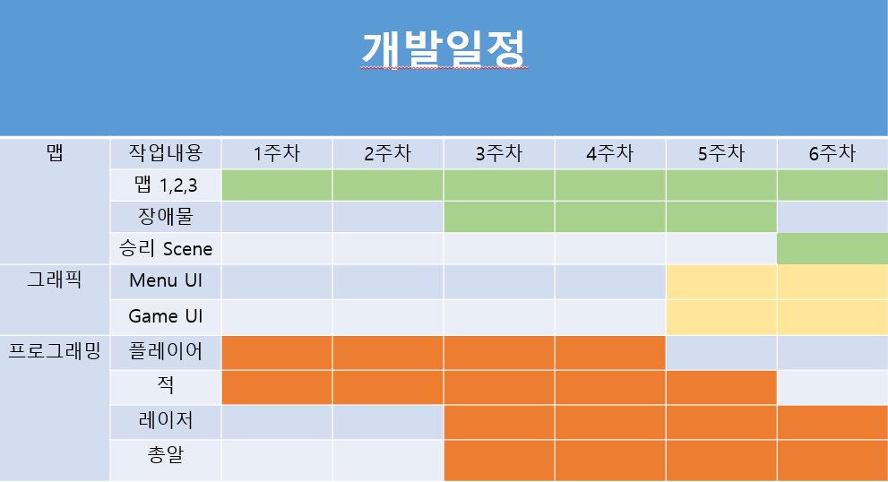

# 프로젝트명: Livin in Hood(개발자:신종호)

# [ 목차 ]
### 1. [컨셉](#1)
### 2. [관련 이미지와 동영상](#2)
### 3. [대표 이미지 그리고 컨셉과 대표이미지 기반 작품 묘사](#3)
### 4. [Livin in Hood의 구성 요소](#4)
### 5. [게임 시스템 디자인](#5)
### 6. [요구사항(6주차)](#6)
### 6. [요구사항(1년차)](#66)
### 7. [시간별 흐름(flowchart)](#7)
### 8. [키보드 이벤트에 대한 흐름도](#8)
### 9. [개발일정](#9)

# [컨셉] 

## 메인컨셉 : 스릴

- 리얼한 후드 길거리에서 총알을 피해야 하는 스릴

### 서브 컨셉 1 : 레이저

- 총알이 날아올 방향을 레이저로 표현해서 미리 총알 궤적을 알 수 있게 하여 난이도 조절이 가능하고 재미 요소가 됨

### 서브 컨셉 2 : 총 쏘는 시스템

- 플레이어가 현재 있는 위치 & 랜덤 위치에 총을 쏴서 유저들이 쉽게 피하지 못하게 하여 게임 난이도와 재미를 높임

### 서브 컨셉 3 : 총 쏘는 컨셉

- 카우보이 맵에서는 AI가 리볼버, 후드 길거리 초입에서는 피스톨, 완연한 후드의 길거리에서는 라이플을 쏩니다.

### 서브 컨셉 4 : 맵

- 좌측, 가운데, 우측 총 3개의 레일 위를 플레이어가 달릴 수 있고 첫번쨰 맵은 카우보이 페스티벌, 두번째 맵은 길거리, 세번째 맵은 완연한 후드의 길거리 입니다.

### 서브 컨셉 5 :긴장감

- 애니메이션이나 영화에서만 보던 총알 피하기를 직접 해봄으로써 긴장감을 느끼고 그것이 큰 재미로 다가옵니다.

  

# [관련 이미지 & 동영상] 

- 이미지  
  
- 동영상
  
  
  

  

# [대표 이미지]

  

  

# [컨셉 & 대표이미지 기반 작품묘사] 

> ### 대표이미지 기반 : 후드에서 살아남기 제 21장 : 경찰 앞에서도 Thug Thug하라.

> ### 컨셉 기반: 뒷일은 생각하지 않는 후드의 길거리에서 살아남기 위해 열심히 살아가는 주인공의 모습

  

# [<Livin in Hood> 구성 요소] 

- [Livin in Hood] 후드에서 살아남기

 

## 1. 메커니즘

[도전 과제]

1. AI의 총을 피해 목표지점까지 도달하라
2. 3가지 맵을 클리어 하여라
3. 자신의 기록을 세워라

[재미 요소]

1. AI가 쏘는 총을 피하며 목표지점에 도달하기
2. 빨간 레이저는 피하고 파란 레이저는 맞아서 살아가야 함
3. 구르거나 앉고 장애물에 몸을 숨겨서 총을 피함

 

## 2. 이야기

[만들게 된 배경]  
유튜브에서 후드에서 살아남기라는 밈을 자주 보면서 너무 재있었고 예전에 봤던 애니메이션에 나왔던 게임과 접목하면 재미있겠다고 생각했습니다.

[카메라 관점]  
3D 1인칭 뷰로 생각하고 나중엔 VR로도 구현해 볼 계획입니다.

 

## 3. 미적요소

[디자인][컬러]  
첫번째 맵은 주인공이 어렸을 때 카우보이 페스티벌에서 후드식 장난을 하는 컨셉입니다.
카우보이가 주인공을 향해 리볼버를 쏘고 주변 사물도 카우보이식대로, 몸을 숨길 장애물로 회전초를 생각했습니다.

두번째 맵은 주인공이 청년이 되었을 때의 모습이고 길거리를 걸어가다가 마주치는 상황을 맵으로 구현할 생각입니다.
AI는 피스톨을 쏘고 몸을 숨길 장애물로는 드럼통or쓰레기통을 생각하고 있습니다.

세번째 맵은 완연한 후드인이 되어 평범한 후드의 삶을 지내는 후드인이 된 주인공의 모습을 컨셉으로 하고 있습니다.
AI는 경찰의 모습으로 라이플을 쏘고 장애물은 경찰차로 할 생각입니다.

[음향]  
카우보이 맵에서는 lil nas x - old town load 를 2,3번째 맵에서는 snoop dog나 eminem등 외국 래퍼의 노래를 생각하고 있습니다.
 

## 4. 기술

unity를 활용해 3D 1인칭 게임을 만들생각입니다.
방학동안에는 VR을 공부해서 최종적으로는 VR게임을 만들어 보도록 할 생각입니다.
  
# [게임 시스템 디자인] 
 
# 1. 게임 오브젝트 분해 (구성 요소 분석)
  
|번호|오브젝트 이름(영문명칭)|오브젝트 이미지|
|:----:|:----:|:----:|
|1|player1,2,3|  |
|2|Ai 1,2,3|  |
|3|Map||
|4|PlayerHp||
  
   
## 2. 파라미터(속성) 뽑아 보기
   
# 1) 오브젝트 이름 : player 1,2,3
  
|속성|영문명칭|설명|비고|
|:----:|:----:|:----:|:----:|
|체력|PlayerHp|플레이어의 체력||
|이동속도|PlayerSpeed|플레이어의 이동 속도||
|구르기|Skill|원하는 방향으로 일정거리 구름|원하는 곳으로 굴러 총알을 피함|
|앉기|Sit|Player.position에 player가 앉음|장애물 뒤에 숨거나 총알을 피함|
  
   
# 2) 오브젝트 이름 : Ai 1,2,3
  
|속성|영문명칭|설명|
|:----:|:----:|:----:|
|사격|Fire|Ai가 Player.position 및 랜덤 위치에 사격|
|레이저|Razer|사격하기 몇초 전 레이저가 총구에서 사격방향으로 나옴|
  
   
  
# 3) 오브젝트 이름 : 맵 1,2,3
  
|속성|영문명칭|설명|장애물|
|:----:|:----:|:----:|:----:|
|서부시대 맵|WesternMap|후드식 페스티벌 속 서부시대 배경으로 하는 총게임의 맵|회전초|
|길거리 초입 맵|StreetMap|Street에서 겪을 수 있는 일상을 자아낸 맵|드럼통|
|후드 길거리 맵|HoodMap|완연한 후드인의 일상을 표현한 맵|경찰차|
|모든 맵은 시간이 지날수록 장애물이 적어짐|

 
  
## 3. 행동 뽑아 보기
  
# 1) 오브젝트 이름 : Player 1,2,3
  
|행동|설명|
|:----:|:----:|
|앞으로 이동(W)|Idle 상태에서 정면으로 이동|
|뒤로 이동(S)|Idle 상태에서 뒤으로 이동|
|좌로 이동(A)|Idle 상태에서 좌로 이동|
|우로 이동(D)|Idle 상태에서 우로 이동|
|구르기(Shift)|쿨타임 6초(구르는 시간은 1.5초)|
|앉기(Ctrl)|쿨타임 2초(앉는 키 누른 동안은 계속 유지)|

 
  
# 2) 오브젝트 이름 : Ai 1,2,3
  
|행동|설명|특징|
|:----:|:----:|:----:|
|사격|Ai가 Player.position 및 랜덤위치에 사격|맵마다 총의 발사속도, 발사하는 탄의 개수를 달리 한다. 1.Anaconda  2.Pistol  3.Rifle|
|레이저|사격하기 몇초 전 레이저가 총구에서 사격방향으로 나옴|빨간 레이저에서 나오는 총알은 데미지를 입히고 파란 레이저에서 나오는 총알은 회복을 시킴|

 
  
## 4. 상태 뽑아 보기
  
# 1) 오브젝트 이름 : Player 1,2,3
  
|현상태|전이상태|전이조건|
|:----:|:----:|:----:|
|Idle|W|Idle 상태에서 정면으로 이동|
|Idle|S|Idle 상태에서 뒤으로 이동|
|Idle|A|Idle 상태에서 좌로 이동|
|Idle|D|Idle 상태에서 우로 이동|
|Idle|Skill|Idle 상태에서 Player가 보는 방향으로 구름(WASD 누른 상태에서도 가능)|
|Idle|Sit|Idle 상태에서 Player가 지금 위치에 앉음|
|Sit|Idle|앉은 상태(Ctrl)을 누른 시간동안 앉은 자세 유지/ Ctrl키 놓으면 Idle 상태|
|Idle|damaged|플레이어가 데미지를 입은 상태(1초간 무적)|
|damaged|Idle|1초간 무적상태에서 Idle 상태로 전환|

 
  
# 2) 오브젝트 이름 : Ai 1,2,3
  
|현상태|전이상태|전이조건|
|:----:|:----:|:----:|
|Idle|Razer|Idle상태가 몇초간 지속되면 Player.position 및 랜덤 위치에 레이저 발사|
|Razer|Fire|빨간색 Razer의 지속시간이 끝나면 발사, 데미지 입힘|
|Razer2|Fire|파란색 Razer의 지속시간이 끝나면 발사, HP회복(맵에 따라 정해진 횟수만 발사)|
|Fire|Idle|사격이 끝나면 Idle 상태로 돌아옴|

 
  
## 5. 플레이어 캐릭터 속성(파라미터)
  
|속성|영문명칭|설명|
|:----:|:----:|:---:-|
|어린 후드인|Player1|어린아이의 모습/ 완숙한 후드인의 1/4의 HP와 이동속도를 가짐|
|젊은 후드인|Player2|성인의 모습/ 완숙한 후드인의 1/2의 HP와 이동속도를 가짐|
|완숙한 후드인|Player3|후드인의 모습/ 빠른 이동속도와 강인한 체력|
 
 
  
## 1) 6. 게임의 규칙
  
플레이어가 AI가 있는 곳까지 도달해야 승리. AI가 쏘는 총에 맞고 체력이 0이 되면 패배. 제한 시간 안에 도달하지 못할 시 패배

## 7. 게임에서 사용될 공식
  
1. 플레이어가 피격 당할 경우 피격상태로 변환 -> 1초간 무적상태 -> HP 감소 -> 일반상태로 변환
2. 제한시간이 있어서 무한정 장애물에 숨을 수 없음
3. 빨간 레이저에서 나온 총에 맞으면 피격, 파란 레이저에서 나온 총에 맞으면 회복

## [요구사항(6주차)] 
 
[맵]
1. 플레이어가 뛰는 길거리 양 옆으로 WesternMap, Street, Hood의 분위기로 길거리와 바닥, 하늘, 장애물도 다르게 제작
2. ~맵에 따라 Ai의 모습, 총기를 달리 한다.~
3. ~Ai는 지정된 장소로 움직이며 맵의 끝자락에 오면 이동을 멈춘다.~
4. ~맵의 시작부터 1/2 구역이 맵의 1/2부터 3/4보다 장애물이 많게 맵 제작.~
5. ~맵의 라인 밖으로는 이동 할 수 없도록 한다.~
 
[그래픽]
1. ~플레이화면 가운데 우측에 HP 바(5/7/10)를 표시한다.~
 
[프로그래밍]
~1. 플레이어는 WASD로 이동하며 마우스로 시점을 회전 할 수 있다.~
~2. Shift를 누르면 플레이어가 보는 방향으로 플레이어가 구른다(쿨타임 6초).~
3. ~Ctrl을 누르면 제자리에 앉는다.~
4. ~player 1,2,3에 따라 이동속도 HP값을 달리 한다.~
5. ~Ai 1,2,3에 따라 총의 발사속도, 발사하는 탄의 개수를 달리 한다.~
6. ~플레이어의 위치 혹은 랜덤한 위치에 랜덤으로 레이저 및 총을 발사한다.~
7. 빨간 레이저는 체력 감소, 파란 레이저는 체력 회복하게 한다.
8. ~플레이어가 피격 시 플레이어의 HP를 줄인다.~
9. 플레이어가 파란색 레이저에 피격 시 플레이어의 최대 HP를 넘기지 않게 한다.
10. ~맵에 있는 장애물에는 레이저와 총알이 막힌다.~
11. 제한시간 혹은 플레이어의 HP가 0이 되었을 경우 Game Over UI를 띄우고 게임을 멈춘다.
12. Game Over UI 밑에는 다시하기와 나가기 버튼이 있다.
13. 목표지점에 도달할 경우 승리 Scene으로 넘어간다.
   
# [요구사항(1년차)] 
 
[시작메뉴]
1. 3가지 맵을 고르는 화면이 있다.
2. 맵을 클릭하고 시작버튼을 누르면 맵에 총알 자국이 생기고 게임이 시작된다.
3. 로딩중에 플레이 할 맵의 샘플 사진이 나옴.
   
[맵]
1. 플레이어가 뛰는 길거리 양 옆으로 WesternMap, Street, Hood의 분위기로 길거리와 바닥, 하늘, 장애물도 다르게 제작
2. 맵에 따라 Ai의 모습, 총기를 달리 한다.
3. 플레이어와 Ai의 거리는 항상 같게 제한하되 Ai는 맵의 끝자락에 오면 이동을 멈춘다.
4. 맵의 시작부터 1/2 구역이 맵의 1/2부터 3/4보다 장애물이 많게 맵 제작.
5. 맵의 라인 밖으로는 이동 할 수 없도록 한다.
  
[그래픽]
1. 플레이화면 가운데 위에 제한시간(5분)을 표시한다.
2. 플레이화면 가운데 우측에 HP 바(5/7/10)를 표시한다.

[프로그래밍]
1. 게임이 시작되면 해당 맵의 가운데 라인에 플레이어가 서있고(1인칭) 5초의 카운트 후 게임이 시작된다.
2. 플레이어는 WASD로 이동하며 마우스로 시점을 회전 할 수 있다.
3. Shift를 누르면 플레이어가 보는 방향으로 플레이어가 구른다(쿨타임 6초).
4. Ctrl을 누르면 제자리에 앉는다(Ctrl을 누르고 있는 동안은 앉는 자세가 유지된다 쿨타임 2초).
5. player 1,2,3에 따라 이동속도 HP값을 달리 한다.
6. Ai 1,2,3에 따라 총의 발사속도, 발사하는 탄의 개수를 달리 한다.
7. 플레이어의 위치(얼굴, 상체, 하체), 랜덤한 위치 혹은 두곳 모두에 랜덤으로 레이저 및 총을 발사한다.
8. 빨간 레이저는 체력 감소, 파란 레이저는 체력 회복하게 한다.
9. 플레이어가 피격 시 잠깐의 정지와 무적타임을 주고 플레이어의 HP를 줄인다.
10. 플레이어가 파란색 레이저에 피격 시 플레이어의 최대 HP를 넘기지 않게 한다.
11. 맵에 있는 장애물에는 레이저와 총알이 막힌다.
12. 제한시간 혹은 플레이어의 HP가 0이 되었을 경우 Game Over UI를 띄우고 게임을 멈춘다.
13. Game Over UI 밑에는 다시하기와 나가기 버튼이 있다.
14. 다시하기를 누를 경우 맵의 처음으로 돌아와 게임을 시작한다.
15. 나가기를 누를 경우 맵 선택 화면으로 돌아간다.
16. 목표지점에 도달할 경우 승리 Scene으로 넘어간다.
17. 3D 1인칭 뷰 게임에서 VR로 제작을 한다.

# [시간별 흐름(flowchart)] 

  - 이미지

  
# [키보드 이벤트에 대한 흐름도] 

- 이미지

  
# [개발 일정] 

- 이미지

